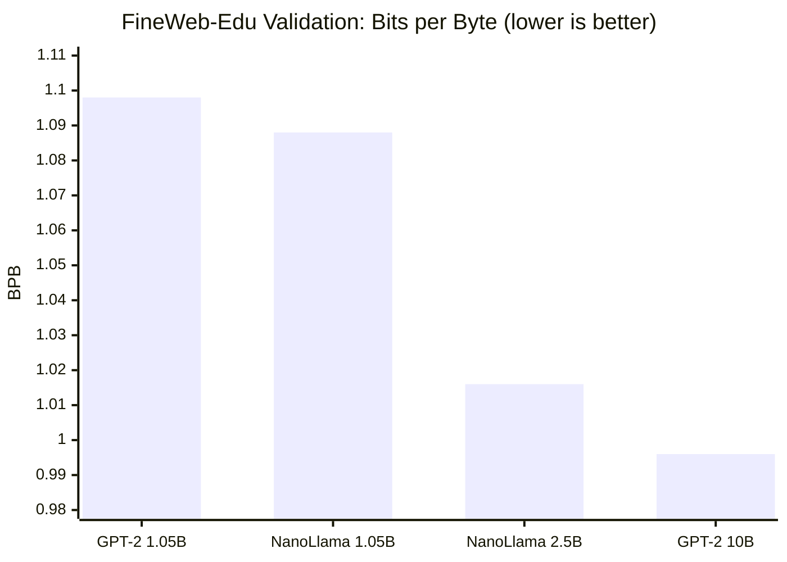

# foundry-llm

`foundry-llm` began as a compact educational decoder-only transformer lab and has gradually grown into a more realistic experimentation and inference stack. The repository still optimizes for readability and iteration speed, but `main` now includes a LLaMA-family architecture (GQA, SwiGLU, RMSNorm, RoPE), package contracts, tokenizer identity rules, a full shard-based pretraining pipeline, a KV-cache inference engine, and a measurement-driven serving + eval layer.

The center of gravity is still a compact `MiniGPT` implementation and a script-first workflow. What changed is the engineering surface: tokenizer behavior is treated as a contract, architecture variants are first-class, the data path carries reproducibility requirements, and the model can now be loaded and served over HTTP with SSE streaming, latency instrumentation, quantization, and safety guardrails. The repo produced **NanoLlama 8L** (127.6M params, 2.5B tokens, val loss 3.36) and serves it with 7.5x cached decode speedup and 70% memory reduction under int8 quantization.

---

## Current capabilities

### Model and inference

- `MiniGPT` is a decoder-only transformer with configurable normalization, MLP variant, attention type, and positional encoding.
- Attention supports standard multi-head attention (`mha`) and grouped-query attention (`gqa`), with `nanollama`-style architecture invariants enforced through config.
- Positional handling includes learned embeddings, sinusoidal embeddings, and RoPE, with RoPE scaling controls exposed as part of model configuration.
- The forward API supports `attention_mask`, `past_key_values`, and `use_cache`, returning logits plus cache state in a decode-ready shape.
- KV cache uses a canonical per-layer `(k, v)` layout and decode-aware causal masking so cached decode and full-sequence execution share one contract.
- Optional `F.scaled_dot_product_attention` (Flash Attention) via `use_sdpa=True`; QK-Norm for GQA via `qk_norm=True`.

### Training and experimentation

- `Trainer` supports `Adam` and decay-group-aware `AdamW`, with optimizer selection exposed through config.
- Training supports gradient accumulation and keeps logging aligned to optimizer-step semantics.
- Scheduling includes constant and cosine LR policies, linear warmup, and LR floor.
- `ShardTrainer` is a step-based pretraining loop that consumes `.npy` shards directly — no DataLoader wrapping needed.
- `ShardLoader` provides both `next_batch()` for step-based loops and `as_iterable_dataset()` for DataLoader-based experiments.
- Runtime controls: CUDA bf16 autocast, best-checkpoint handling, CSV loss curves, status curves, progress telemetry.

### Tokenization and data

- `CharTokenizer` is the minimal baseline path for early workflows.
- `SubwordTokenizer` is a stable facade over legacy BPE and SentencePiece backends.
- Reserved tokens `<|pad|>`, `<|user|>`, `<|assistant|>`, `<|endoftext|>` are fixed across all tokenizer backends.
- Tokenizer artifacts are backend-aware and carry behavior-based identity through hashing.
- FineWeb-Edu pipeline: `data/prepare_dataset.py` streams from HuggingFace, tokenizes with GPT-2 BPE (tiktoken), and writes `uint16 .npy` shards for `ShardLoader`/`ShardTrainer`.

### Serving and inference

- `Engine` splits inference into `prefill()` (one model call, seeds KV cache) and `decode_step()` (one token per call, extends cache). Sliding window policy bounds cache growth.
- FastAPI endpoints: `POST /generate` (sync), `POST /stream` (SSE token streaming with stop-string holdback), `GET /health`, `GET /metrics`.
- Full sampling pipeline: temperature, top-k, top-p (nucleus), repetition penalty, frequency penalty — with greedy short-circuit at temperature=0.
- Stop taxonomy: EOS token, custom stop token IDs, stop strings (text-level), max_new_tokens. Markers excluded from visible output.
- Prefill batching: right-pad + attention mask for variable-length prompts in a single forward pass; decode remains B=1.
- Precision: fp16/bf16/fp32 with device-aware fallback. int8 dynamic quantization via `torch.quantization.quantize_dynamic` (qnnpack).
- Safety: PII detection (email/phone/SSN regex), profanity filter, refusal template. Pre-filter on prompt, post-filter on generated text.
- Privacy-preserving structured logs: prompt SHA-256 hash, no raw text by default. Per-request metrics (TTFT, prefill_ms, decode_ms/token, tokens/sec).
- Rate limiting: fixed-window per-client with 429 + Retry-After.
- Tiktoken support: `TiktokenWrapper` adapts tiktoken GPT-2 for NanoLlama (filters out-of-vocab IDs 50257-50303, resolves EOS=50256).

### Evaluation

- Streaming perplexity: sliding-window NLL with configurable stride and max sequence length.
- Prompt suite: 6 bucketed test cases (short/long prompt, repetition trap, stop trap, code-like, safety probe) with engine and HTTP backends.
- Quantization sweep: fp32/fp16/bf16/int8 precision matrix with PPL drift, latency, and memory measurements.
- Evidence pack builder: cache equivalence report, TTFT/TPS curves across context lengths and batch sizes, KV-cache memory economics (MHA vs GQA formula + measurements).

### Testing and validation

- `tests/core/` covers forward contracts, decoding, RoPE, GQA, norms, MLP variants, trainer semantics, tokenizer IO, and package IO.
- `tests/serving/` covers KV-cache ABI, cache equivalence, engine structure, stop/EOS, sampling, API endpoints, SSE streaming, metrics, batching, rate limiting, safety, precision, quantization, and tiktoken wrapper.
- `tests/eval/` covers prompt suite data contracts, report building, evidence pack, quantization audit, and research lane guards.
- 152 tests total, all passing.

---

## NanoLlama 8L — flagship result

The lab culminated in training **NanoLlama 8L**: a 127.6 M-parameter
LLaMA-family model pretrained on FineWeb-Edu (GPT-2 BPE, 2.5 B tokens,
RTX 4090, ~9 hours).

```
Architecture  : 8 layers · d_model=768 · 12 heads · GQA (kv=4) · SwiGLU · RMSNorm · RoPE
Parameters    : 127.6 M  (no weight tying)
Training data : FineWeb-Edu 10B sample (Hugging Face, educational text)
Tokeniser     : GPT-2 BPE via tiktoken (vocab 50 304)
Compute       : 1× RTX 4090, ~9.2 h wall time, ~75 940 tok/s
```

### Results vs published baselines

All numbers are on the **same FineWeb-Edu validation shard** with the same
GPT-2 BPE tokeniser (bytes/token = 4.766, measured from the actual val shard).

| Model | Arch | Tokens | Val loss | BPB |
|---|---|---|---|---|
| **NanoLlama 8L (ours)** | LLaMA-family (GQA + SwiGLU + RoPE + RMSNorm) | **2.5 B** | **3.3566** | **1.016** |
| GPT-2 124M baseline | Vanilla GPT-2 (MHA + GELU + LN + learned pos) | 10 B | 3.29 | 0.996 |
| GPT-2 124M baseline | Vanilla GPT-2 | 1.05 B | 3.6273 | 1.098 |
| NanoLlama @ 1.05 B tok | LLaMA-family | 1.05 B | ~3.589 | ~1.088 |



**At compute-matched 1.05 B tokens**, NanoLlama is already 0.010 BPB ahead
of the vanilla GPT-2 baseline — the LLaMA-family architecture pays off even
before seeing more data.

**At 2.5 B tokens**, NanoLlama is only 0.020 BPB behind the 10 B-token GPT-2
reference — closing 4× the token gap with a better architecture.

**HellaSwag (10,042 items, normalized accuracy): 0.2696** — above random (0.25)
and above the GPT-2 baseline (~0.238 at 1.05B tokens).
See `scripts/eval/eval_hellaswag.py` (`data/hellaswag_val.jsonl` included).

### Val loss trajectory

```
step  250  →  5.19   (still in warmup)
step  500  →  4.36
step 1000  →  3.87
step 2000  →  3.58
step 3000  →  3.45
step 4000  →  3.38
step 4768  →  3.36   ← final checkpoint
```

Loss curve shows healthy cosine decay with no instabilities.

---

## NanoLlama v2 — 127M with architectural refinements

A second training run on the same 127M / FineWeb-Edu setup, adding four
architectural features from the SwiftLlama research line:

```
Architecture  : 8 layers · d_model=768 · 12 heads · GQA (kv=4) · SwiGLU · RMSNorm
New features  : partial RoPE (rope_fraction=0.5) · value embeddings (n=2)
                x0-mixin residual (λ·x + λ₀·x₀) · logit softcap=30 · qk_norm
Optimizer     : AdamW (standard; Muon not used here)
Training data : FineWeb-Edu 10B (same corpus)
Tokens        : 5.0 B  (2× NanoLlama v1)
Compute       : 1× RTX 4090
```

| | v1 NanoLlama 8L | v2 NanoLlama |
|---|---|---|
| Tokens | 2.5 B | 5.0 B |
| Val loss | 3.3566 | **3.2210** |
| Δ vs v1 | — | **−0.136** |

The Δ combines extra tokens (2×) and architecture changes; the two contributions
are not isolated. Config: `configs/nanollama_v2_127m.json`.

---

## SwiftLlama-350M — scaled to 345M with Muon optimizer

Scales the v2 architecture to 345M parameters with a 4096-token context and
the Muon optimizer.

```
Architecture  : 22 layers · d_model=1024 · 16 heads · GQA (kv=4) · SwiGLU · RMSNorm
Features      : partial RoPE (0.5) · value embeddings · x0-mixin · logit softcap=30
Optimizer     : Muon (weight matrices) + AdamW (embeddings, norms, scalars)
Training data : FineWeb-Edu 10B
Target        : 28 610 steps · ~15 B tokens
Compute       : 1× RTX 4090 · ~20.4 s/step · bfloat16
```

**Optimizer selection** (1500-step probes at 345M scale):

| Optimizer | val@500 | Δ vs AdamW |
|-----------|---------|-----------|
| Muon + Adam | 6.6623 | **−0.261** |
| AdamW | 6.9237 | — |

Muon consistently leads by ~0.26 nats at early steps.

**Validation trajectory** (in progress, best checkpoint at step 16 000):

| Step | Tokens seen | Val loss |
|------|-------------|----------|
| 2 000 | 1.05 B | 3.826 |
| 7 000 | 3.67 B | 3.520 |
| 11 500 | 6.03 B | 3.414 |
| **16 000** | **8.39 B** | **3.3566** |

At step 16 000 SwiftLlama matches NanoLlama v1's final val loss (3.3566) having
consumed 3.3× more tokens — expected for a 2.7× larger model. Training is ongoing.

**Benchmarks at step 7 000** (3.67 B tokens, undertrained relative to Chinchilla):

| Task | Random | SwiftLlama-350M | NanoLlama-127M |
|------|--------|----------------|----------------|
| PIQA | 0.500 | 0.584 | **0.601** |
| ARC-Easy | 0.250 | 0.351 | **0.381** |
| HellaSwag | 0.250 | 0.268 | **0.270** |
| WinoGrande | 0.500 | 0.512 | 0.503 |
| Lambada | — | 0.292 | **0.328** |

NanoLlama-127M leads on 4/5 tasks because it is near Chinchilla-optimal
(19.6× tokens/params) while SwiftLlama at step 7 000 is at 10.5× (53% of
Chinchilla). The comparison will shift at SwiftLlama's full training budget.

Config: `configs/swiftllama_350m.json`.

---

## Reproduce in two commands

```bash
# Step 1 — download and tokenise FineWeb-Edu (~45 min, ~20 GB disk)
python data/prepare_dataset.py

# Step 2 — train NanoLlama 8L (~9 h on a single RTX 4090)
python scripts/pretrain_nanollama.py
```

All hyperparameters live in `configs/nanollama_8l.json`.
Checkpoints are saved every 500 steps; the script auto-detects CUDA / MPS / CPU.

```bash
# Shorter smoke test (5 steps, any hardware):
python scripts/pretrain_nanollama.py --max_steps 5 --device cpu
```

---

## Evolution / decision log

- **Dec 2025 (foundation)** — char tokenization, attention, transformer blocks, `MiniGPT`, trainer, sampling. The goal was a self-contained teaching codebase where every line is legible.
- **Late Dec 2025 (experimentation surface)** — subword tokenization, package IO, config-driven training, positional encoding variants (learned, sinusoidal, RoPE). The repo becomes usable for real experiments, not just walkthroughs.
- **Jan 2026 (architecture)** — GQA, fixed reserved-token ABI, RoPE scaling, `nanollama`-family config invariants. Decision: invest in LLaMA-family architecture early so the model stack doesn't need rewiring before pretraining.
- **Feb 2026** — AdamW decay groups. Attention hot-path optimization (1.44x microbench, causal mask caching).
- **Early Mar 2026 (inference contracts)** — KV-cache ABI through the forward path (`past_key_values`, `use_cache`, `attention_mask` for right-padding). This was prerequisite work for serving — the model needed to return cache in a canonical shape before an engine could consume it.
- **Mid Mar 2026 (training stack)** — gradient accumulation, cosine scheduling with warmup, bf16 autocast, checkpoint handling, progress telemetry. SentencePiece tokenizer backend with behavior-based hashing. Deterministic pretokenized shard pipeline for `ShardTrainer`.
- **Mar 2026 (calibration)** — GPT-2 124M reproduction on FineWeb-Edu as reference baseline (val 3.6273 at 1.05B tokens). Without a calibrated baseline, all subsequent numbers are unanchored.
- **Mar 2026 (ablation)** — 8-run swap ablation isolating RoPE, SwiGLU, GQA, QK-Norm, RMSNorm, logit softcap. RoPE (−0.386 val loss) and SwiGLU (−0.139) dominate. This confirmed the architecture choices before committing to a full run.
- **Mar 2026 (pretraining)** — NanoLlama 8L: 4768 steps, 2.5B tokens, RTX 4090, ~9h. Val 3.3566 (BPB 1.016), HellaSwag 0.2696. Only 0.020 BPB behind the 10B-token GPT-2 reference.
- **Mar–Apr 2026 (serving)** — the question shifts from "can we train it" to "can we serve it with measured latency." KV-cache engine with prefill/decode separation; correctness proven before optimization (cache equivalence gate: max |logit_diff| 6.68e-06). Measured 7.5x decode speedup on NanoLlama. FastAPI with SSE streaming, batched prefill, rate limiting, PII/profanity safety filters. int8 dynamic quantization: 70% memory reduction at +6% PPL drift and 1.27x faster decode — the insight being that int8 helps large models (memory-bandwidth-bound) but hurts small ones (compute-overhead-bound). Tiktoken adapter for NanoLlama with out-of-vocab filtering. Prompt suite, perplexity regression, evidence pack with TTFT/TPS curves across context lengths and batch sizes. 152 tests.
- **Apr 2026 (architecture + scale)** — second-generation architecture: partial RoPE (`rope_fraction`), per-layer value embeddings (`n_value_embeds`), x0-mixin residual mixing, ReLU² MLP variant, Muon optimizer. NanoLlama v2 (127M, 5B tokens) reaches val 3.221 — an improvement of 0.136 nats over v1, combining extra tokens and architectural changes. SwiftLlama-350M (345M, Muon, 4096-token context) begins training; Muon shows +0.26 nats improvement over AdamW at step 500 in 1500-step probes.
---

## Repository layout

```
foundry-llm/
├── configs/
│   ├── nanollama_8l.json          ← NanoLlama 8L config (model + training)
│   └── p1/                        ← toy experiment configs
├── data/
│   ├── prepare_dataset.py         ← download + tokenise FineWeb-Edu into .npy shards
│   └── hellaswag_val.jsonl        ← HellaSwag val set (10 042 items, ready to use)
├── scripts/
│   ├── interact.py                ← interactive sampling REPL
│   ├── core/                      ← model training & benchmarking
│   ├── serving/                   ← inference API, quantization, benchmarks
│   ├── eval/                      ← evaluation & evidence pack
│   ├── pretrain/                  ← NanoLlama pretraining entry point
│   ├── data/                      ← data preparation & shards
│   └── research/                  ← research lane & overnight scripts
├── docs/
│   ├── ablation_analysis.md       ← swap ablation results + confound analysis
│   ├── eval_results.md            ← full eval suite output + implementation notes
│   ├── local_artifacts.md         ← all local checkpoint / log / CSV paths ← START HERE
│   ├── replication.md             ← step-by-step reproduction guide
│   └── serving_nanollama_tiktoken.md ← tiktoken ↔ serving layer integration guide
├── results/
│   ├── nanollama_8l_training.csv  ← full 4 768-step training trajectory
│   └── ablation_summary.csv       ← 8-swap ablation table (swap confound flagged)
├── bin/
│   ├── push_to_registry.sh        ← build + push Docker image to registry
│   ├── sync_remote_code.sh        ← rsync source to a running remote pod over SSH
│   ├── runpod_container_entrypoint.sh ← container entrypoint (SSH + conda env)
│   └── ...                        ← additional cloud ops helpers
├── Dockerfile                     ← vastai/pytorch base, CUDA 13.2, Python 3.11
├── llm_lab/
│   ├── core/
│   │   ├── model/                 ← MiniGPT, attention (MHA/GQA/SDPA), blocks, norms
│   │   ├── train/                 ← Trainer, ShardTrainer, lr_schedule, AdamW groups
│   │   ├── data/                  ← ShardLoader, CharDataset, LanguageModelingDataset
│   │   ├── decode/                ← greedy, temperature, top-k, top-p sampling
│   │   ├── tokenization/          ← CharTokenizer, SubwordTokenizer, TiktokenWrapper
│   │   └── package/               ← model packaging I/O + NanoLlama loader
│   ├── serving/                   ← inference engine, FastAPI, streaming, safety, quant
│   └── eval/                      ← perplexity, prompt suite, report builder
├── tests/
│   ├── core/                      ← model, training, tokenization tests
│   ├── serving/                   ← engine, API, cache, precision, safety tests
│   └── eval/                      ← prompt suite, report, evidence pack tests
```

---

## Setup

```bash
python -m venv .venv
source .venv/bin/activate
pip install --upgrade pip
pip install -r requirements.txt
```

Notes:
- `sentencepiece` is required for the SentencePiece tokenizer backend.
- `datasets` and `tiktoken` are required for FineWeb-Edu prep (`data/prepare_dataset.py`).
- bf16 training is supported on CUDA only.

### Docker (cloud GPU / Vast.ai / RunPod)

A production-ready image is included for remote GPU training:

```bash
# Build and push to registry (uses BuildKit secret for optional HF auth)
bin/push_to_registry.sh

# Sync local code changes into a running pod over SSH
REMOTE_HOST=<host> bin/sync_remote_code.sh

# Local smoke test — builds image and runs verify-local pipeline
bin/verify_hero_config.sh
```

Base image: `vastai/pytorch:2.11.0-cu130-cuda-13.2-mini-py311` (PyTorch 2.11, CUDA 13.2, Python 3.11).
HF token is injected at build time via `--secret id=hf_token` (never stored in image layers).
See `docs/replication.md` for cloud GPU setup notes (persistent volumes, OOM prevention).

---

## Evaluate

```bash
# Full 11-test eval suite (generation, perplexity, entropy, HellaSwag proxy)
python scripts/eval/eval_suite.py --ckpt out/ckpts/step_04768_model_only.pt

# Real HellaSwag benchmark — 10 042 items, ~10 min on CPU (~0.2696 expected)
python scripts/eval/eval_hellaswag.py --ckpt out/ckpts/step_04768_model_only.pt

# Interactive sampling REPL
python -i scripts/interact.py --ckpt out/ckpts/step_04768_model_only.pt
# >>> nucleus("Photosynthesis is")
# >>> ppl("The mitochondria is the powerhouse of the cell.")
```

---

## Training scripts

Character-level:
- `python scripts/core/train_char.py` — tiny "hello world" example
- `python scripts/core/train_char_real.py` — real-text training on `data/tiny_shakespeare.txt`
- `python scripts/core/env_sanity.py` — device sanity check (CPU/MPS/CUDA)

Subword (BPE):
- `python scripts/core/train_bpe.py` — train BPE tokenizer + MiniGPT, save model package

Positional encodings:
- `python scripts/core/train_posenc.py` — compare learned, sinusoidal, and RoPE configs

Pretraining:
- `python data/prepare_dataset.py` — download + tokenise FineWeb-Edu
- `python scripts/pretrain/pretrain_nanollama.py` — NanoLlama 8L (`configs/nanollama_8l.json`)
- `python scripts/train_nanollama_v2.py` — NanoLlama v2 with Muon or AdamW (`configs/nanollama_v2_127m.json`)
- `python scripts/train_swiftllama_350m.py` — SwiftLlama-350M with Muon (`configs/swiftllama_350m.json`)

Serving:
- `python scripts/serving/serve.py` — start FastAPI inference server
- `python scripts/serving/serving_client.py` — streaming CLI client
- `python scripts/serving/bench_inference.py` — cache vs recompute benchmarking

Evaluation:
- `python scripts/eval/eval_hellaswag.py` — full HellaSwag benchmark (10 042 items)
- `python scripts/eval/eval_suite.py` — 11-test eval suite (generation, ppl, entropy)
- `python scripts/eval/eval_prompt_suite.py` — prompt suite runner with safety checks

---

## Tests

```bash
pytest -q
pytest tests/core/test_shard_trainer.py -v    # ShardTrainer step loop
pytest tests/core/test_lr_schedule.py -v      # LR schedule functions
pytest tests/core/test_shard_loader.py -v     # ShardLoader / IterableDataset
```

---

## Model API

```python
import torch
from llm_lab.core.model.gpt import MiniGPT, MiniGPTConfig

# Load pretrained NanoLlama 8L
ckpt = torch.load(
    "out/ckpts/step_04768_model_only.pt",   # default output path from pretrain_nanollama.py
    map_location="cpu",
)
model = MiniGPT(MiniGPTConfig(**ckpt["config"]))
model.load_state_dict(ckpt["model_state_dict"])
model.eval()

logits, _ = model(input_ids)   # logits: [B, T, vocab_size]
```

Packaging (for smaller models):
```python
from llm_lab.core.package.io import save_model_package, load_model_package

save_model_package("artifacts/my_run", config, tokenizer, model, is_best=True)
cfg, tok, model = load_model_package("artifacts/my_run")
```

---

## Serve NanoLlama 8L

The serving layer is tokenizer-agnostic and supports two model formats:

- `--loader package` (default) — sp16k SubwordTokenizer packages
- `--loader nanollama` — raw `.pt` checkpoints with tiktoken GPT-2

### HTTP

```bash
# Start the server
python scripts/serving/serve.py \
  --package experiments/tinyllama_pretrain_2026-03-31/phase6/ckpts/step_04768_model_only.pt \
  --loader nanollama --device cpu --dtype fp32

# Sync generation
curl -X POST http://127.0.0.1:8000/generate \
  -H "Content-Type: application/json" \
  -d '{"prompt": "The meaning of life is", "max_new_tokens": 64, "temperature": 0.8, "top_k": 40}'

# SSE streaming
curl -N -X POST http://127.0.0.1:8000/stream \
  -H "Content-Type: application/json" \
  -d '{"prompt": "Once upon a time", "max_new_tokens": 128, "temperature": 0.7}'

# Health + metrics
curl http://127.0.0.1:8000/health
curl http://127.0.0.1:8000/metrics
```

Every response returns `ttft_ms`, `prefill_ms`, `decode_ms_per_token`, `tokens_per_sec`, `stop_reason`, and `safety_flags`.

### Programmatic

```python
from llm_lab.core.package.nanollama_loader import load_nanollama_checkpoint
from llm_lab.serving.engine import Engine

cfg, tokenizer, model = load_nanollama_checkpoint(
    "experiments/tinyllama_pretrain_2026-03-31/phase6/ckpts/step_04768_model_only.pt",
    device="cpu",
)
engine = Engine(model=model, tokenizer=tokenizer,
                block_size=cfg.block_size, max_cache_len=cfg.block_size)

out = engine.generate(
    prompt_ids=tokenizer.encode("Once upon a time"),
    attention_mask=None, max_new_tokens=64,
    temperature=0.7, top_k=40,
    eos_token_id=tokenizer.eos_token_id,
)
print(out["completion_text"])
```

For full API reference, code structure, and tokenizer interface contract see [`docs/serving.md`](docs/serving.md).

---

## Known limits

- The repo is script-first rather than a unified CLI or application.
- bf16 training is CUDA-only; MPS/CPU run fp32. fp16/bf16 serving falls back to fp32 on CPU.
- Greedy decoding produces repetition loops — expected for pretrain-only models. Use nucleus sampling.
- Decode is B=1 only; batched prefill works but each request decodes sequentially.
- No continuous/dynamic batching, speculative decoding, or prefix caching.
- int8 prefill is ~3x slower than fp32 on CPU (dynamic quantization overhead); int8 decode is 1.27x faster.
- Safety filters are heuristic (regex PII, narrow profanity list) — suitable for demonstration, not production.
- NanoLlama has no chat template — use plain text prompting.
