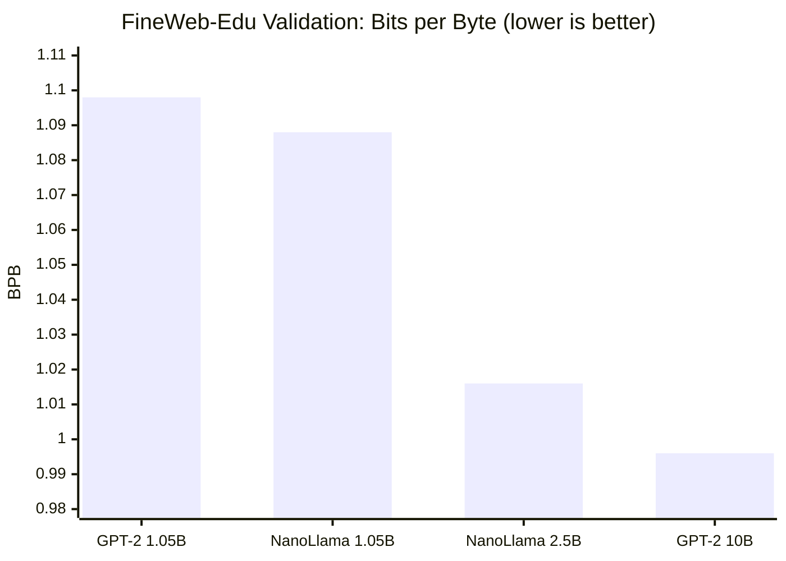

# foundry-llm

`foundry-llm` began as a compact educational decoder-only transformer lab and has gradually grown into a more realistic experimentation stack. The repository still optimizes for readability and iteration speed, but `main` now includes stronger architecture choices, package contracts, tokenizer identity rules, cache-aware inference plumbing, richer trainer controls, and a full shard-based pretraining pipeline.

The center of gravity is still a compact `MiniGPT` implementation and a script-first workflow. What changed is the engineering surface around it: tokenizer behavior is treated as a contract, package reload paths are explicit, architecture variants are first-class, and the data path now carries reproducibility and provenance requirements. It is still not a production platform, but it is no longer just a toy MiniGPT repo.

---

## Current capabilities

### Model and inference

- `MiniGPT` is a decoder-only transformer with configurable normalization, MLP variant, attention type, and positional encoding.
- Attention supports standard multi-head attention (`mha`) and grouped-query attention (`gqa`), with `nanollama`-style architecture invariants enforced through config.
- Positional handling includes learned embeddings, sinusoidal embeddings, and RoPE, with RoPE scaling controls exposed as part of model configuration.
- The forward API supports `attention_mask`, `past_key_values`, and `use_cache`, returning logits plus cache state in a decode-ready shape.
- KV cache uses a canonical per-layer `(k, v)` layout and decode-aware causal masking so cached decode and full-sequence execution share one contract.
- Optional `F.scaled_dot_product_attention` (Flash Attention) via `use_sdpa=True`; QK-Norm for GQA via `qk_norm=True`.

### Training and experimentation

- `Trainer` supports `Adam` and decay-group-aware `AdamW`, with optimizer selection exposed through config.
- Training supports gradient accumulation and keeps logging aligned to optimizer-step semantics.
- Scheduling includes constant and cosine LR policies, linear warmup, and LR floor.
- `ShardTrainer` is a step-based pretraining loop that consumes `.npy` shards directly — no DataLoader wrapping needed.
- `ShardLoader` provides both `next_batch()` for step-based loops and `as_iterable_dataset()` for DataLoader-based experiments.
- Runtime controls: CUDA bf16 autocast, best-checkpoint handling, CSV loss curves, status curves, progress telemetry.

### Tokenization and data

- `CharTokenizer` is the minimal baseline path for early workflows.
- `SubwordTokenizer` is a stable facade over legacy BPE and SentencePiece backends.
- Reserved tokens `<|pad|>`, `<|user|>`, `<|assistant|>`, `<|endoftext|>` are fixed across all tokenizer backends.
- Tokenizer artifacts are backend-aware and carry behavior-based identity through hashing.
- FineWeb-Edu pipeline: `data/prepare_dataset.py` streams from HuggingFace, tokenizes with GPT-2 BPE (tiktoken), and writes `uint16 .npy` shards for `ShardLoader`/`ShardTrainer`.

### Testing and validation

- `tests/core` covers forward contracts, decoding, RoPE, GQA, norms, MLP variants, trainer semantics, tokenizer IO, and package IO.
- Deterministic contract tests for tokenizer identity, shard provenance, and boundary-safe sample generation.
- New: `test_shard_trainer.py`, `test_shard_loader.py`, `test_lr_schedule.py`, `test_trainer_shard_compat.py`.

---

## NanoLlama 8L — flagship result

The lab culminated in training **NanoLlama 8L**: a 127.6 M-parameter
LLaMA-family model pretrained on FineWeb-Edu (GPT-2 BPE, 2.5 B tokens,
RTX 4090, ~9 hours).

```
Architecture  : 8 layers · d_model=768 · 12 heads · GQA (kv=4) · SwiGLU · RMSNorm · RoPE
Parameters    : 127.6 M  (no weight tying)
Training data : FineWeb-Edu 10B sample (Hugging Face, educational text)
Tokeniser     : GPT-2 BPE via tiktoken (vocab 50 304)
Compute       : 1× RTX 4090, ~9.2 h wall time, ~75 940 tok/s
```

### Results vs published baselines

All numbers are on the **same FineWeb-Edu validation shard** with the same
GPT-2 BPE tokeniser (bytes/token = 4.766, measured from the actual val shard).

| Model | Arch | Tokens | Val loss | BPB |
|---|---|---|---|---|
| **NanoLlama 8L (ours)** | LLaMA-family (GQA + SwiGLU + RoPE + RMSNorm) | **2.5 B** | **3.3566** | **1.016** |
| GPT-2 124M baseline | Vanilla GPT-2 (MHA + GELU + LN + learned pos) | 10 B | 3.29 | 0.996 |
| GPT-2 124M baseline | Vanilla GPT-2 | 1.05 B | 3.6273 | 1.098 |
| NanoLlama @ 1.05 B tok | LLaMA-family | 1.05 B | ~3.589 | ~1.088 |



**At compute-matched 1.05 B tokens**, NanoLlama is already 0.010 BPB ahead
of the vanilla GPT-2 baseline — the LLaMA-family architecture pays off even
before seeing more data.

**At 2.5 B tokens**, NanoLlama is only 0.020 BPB behind the 10 B-token GPT-2
reference — closing 4× the token gap with a better architecture.

**HellaSwag (10,042 items, normalized accuracy): 0.2696** — above random (0.25)
and above the GPT-2 baseline (~0.238 at 1.05B tokens).
See `scripts/eval_hellaswag.py` (`data/hellaswag_val.jsonl` included).

### Val loss trajectory

```
step  250  →  5.19   (still in warmup)
step  500  →  4.36
step 1000  →  3.87
step 2000  →  3.58
step 3000  →  3.45
step 4000  →  3.38
step 4768  →  3.36   ← final checkpoint
```

Loss curve shows healthy cosine decay with no instabilities.


## Reproduce in two commands

```bash
# Step 1 — download and tokenise FineWeb-Edu (~45 min, ~20 GB disk)
python data/prepare_dataset.py

# Step 2 — train NanoLlama 8L (~9 h on a single RTX 4090)
python scripts/pretrain_nanollama.py
```

All hyperparameters live in `configs/nanollama_8l.json`.
Checkpoints are saved every 500 steps; the script auto-detects CUDA / MPS / CPU.

```bash
# Shorter smoke test (5 steps, any hardware):
python scripts/pretrain_nanollama.py --max_steps 5 --device cpu
```

---

## Evolution / decision log

- **2025-12-05 to 2025-12-11** — establish the teaching baseline with char tokenization, char datasets, attention, transformer blocks, `MiniGPT`, trainer, and sampling.
- **2025-12-13 to 2025-12-30** — expand the lab into a usable experimentation repo with subword tokenization, package IO, config loading, training and sampling scripts, positional encoding variants, and broader test coverage.
- **2026-01-01** — add benchmarking scripts and optimize attention hot paths.
- **2026-01-07 to 2026-01-09** — move toward a more realistic decoder architecture with GQA, fixed reserved-token ABI, GPT-style pretokenization, RoPE scaling, and `nanollama`-family invariants.
- **2026-02-22** — add AdamW decay groups and cleaner optimizer handling in the trainer.
- **Early March 2026** — add KV-cache-aware inference contracts, decode-aware masking, and canonical cache layout through the model stack.
- **Mid March 2026** — add stronger trainer runtime controls: accumulation, scheduling, bf16 support, checkpoint handling, and progress/status telemetry.
- **Late March 2026** — add SentencePiece-backed tokenizer artifacts, behavior-based tokenizer hashing, and the deterministic pretokenized shard pipeline.
- **March 2026 (calibration)** — reproduce GPT-2 124M on FineWeb-Edu as a reference baseline: val loss 3.6273 at 1.05 B tokens.
- **March 2026 (ablation)** — 8-run architecture ablation isolating the contribution of RoPE, SwiGLU, GQA, QK-Norm, RMSNorm, and logit softcap. RoPE (−0.386) and SwiGLU (−0.139) dominate.
- **March 2026 (pretraining)** — full NanoLlama 8L pretraining run: 4 768 steps, 2.5 B tokens, RTX 4090, ~9 h. Final val loss 3.3566 (BPB 1.016). HellaSwag: 0.2696.

---

## Repository layout

```
foundry-llm/
├── configs/
│   ├── nanollama_8l.json          ← NanoLlama 8L config (model + training)
│   └── p1/                        ← toy experiment configs
├── data/
│   ├── prepare_dataset.py         ← download + tokenise FineWeb-Edu into .npy shards
│   └── hellaswag_val.jsonl        ← HellaSwag val set (10 042 items, ready to use)
├── scripts/
│   ├── interact.py                ← interactive sampling REPL
│   ├── core/                      ← model training & benchmarking
│   ├── serving/                   ← inference API, quantization, benchmarks
│   ├── eval/                      ← evaluation & evidence pack
│   ├── pretrain/                  ← NanoLlama pretraining entry point
│   ├── data/                      ← data preparation & shards
│   └── research/                  ← research lane & overnight scripts
├── docs/
│   ├── ablation_analysis.md       ← swap ablation results + confound analysis
│   ├── eval_results.md            ← full eval suite output + implementation notes
│   └── replication.md             ← step-by-step reproduction guide
├── results/
│   ├── nanollama_8l_training.csv  ← full 4 768-step training trajectory
│   └── ablation_summary.csv       ← 8-swap ablation table (swap confound flagged)
├── bin/
│   ├── push_to_registry.sh        ← build + push Docker image to registry
│   ├── sync_remote_code.sh        ← rsync source to a running remote pod over SSH
│   ├── runpod_container_entrypoint.sh ← container entrypoint (SSH + conda env)
│   └── ...                        ← additional cloud ops helpers
├── Dockerfile                     ← vastai/pytorch base, CUDA 13.2, Python 3.11
├── llm_lab/core/
│   ├── model/                     ← MiniGPT, attention (MHA/GQA/SDPA), blocks, norms
│   ├── train/                     ← Trainer, ShardTrainer, lr_schedule, AdamW groups
│   ├── data/                      ← ShardLoader, CharDataset, LanguageModelingDataset
│   ├── decode/                    ← greedy, temperature, top-k, top-p sampling
│   ├── tokenization/              ← CharTokenizer, SubwordTokenizer (BPE + SentencePiece)
│   └── package/                   ← model packaging I/O
└── tests/core/                    ← unit + smoke tests
```

---

## Setup

```bash
python -m venv .venv
source .venv/bin/activate
pip install --upgrade pip
pip install -r requirements.txt
```

Notes:
- `sentencepiece` is required for the SentencePiece tokenizer backend.
- `datasets` and `tiktoken` are required for FineWeb-Edu prep (`data/prepare_dataset.py`).
- bf16 training is supported on CUDA only.

### Docker (cloud GPU / Vast.ai / RunPod)

A production-ready image is included for remote GPU training:

```bash
# Build and push to registry (uses BuildKit secret for optional HF auth)
bin/push_to_registry.sh

# Sync local code changes into a running pod over SSH
REMOTE_HOST=<host> bin/sync_remote_code.sh

# Local smoke test — builds image and runs verify-local pipeline
bin/verify_hero_config.sh
```

Base image: `vastai/pytorch:2.11.0-cu130-cuda-13.2-mini-py311` (PyTorch 2.11, CUDA 13.2, Python 3.11).
HF token is injected at build time via `--secret id=hf_token` (never stored in image layers).
See `docs/replication.md` for cloud GPU setup notes (persistent volumes, OOM prevention).

---

## Evaluate

```bash
# Full 11-test eval suite (generation, perplexity, entropy, HellaSwag proxy)
python scripts/eval_suite.py --ckpt out/ckpts/step_04768_model_only.pt

# Real HellaSwag benchmark — 10 042 items, ~10 min on CPU (~0.2696 expected)
python scripts/eval_hellaswag.py --ckpt out/ckpts/step_04768_model_only.pt

# Interactive sampling REPL
python -i scripts/interact.py --ckpt out/ckpts/step_04768_model_only.pt
# >>> nucleus("Photosynthesis is")
# >>> ppl("The mitochondria is the powerhouse of the cell.")
```

---

## Training scripts

Character-level:
- `python scripts/core/train_char.py` — tiny "hello world" example
- `python scripts/core/train_char_real.py` — real-text training on `data/tiny_shakespeare.txt`
- `python scripts/core/env_sanity.py` — device sanity check (CPU/MPS/CUDA)

Subword (BPE):
- `python scripts/core/train_bpe.py` — train BPE tokenizer + MiniGPT, save model package

Positional encodings:
- `python scripts/core/train_posenc.py` — compare learned, sinusoidal, and RoPE configs

Pretraining:
- `python data/prepare_dataset.py` — download + tokenise FineWeb-Edu
- `python scripts/pretrain/pretrain_nanollama.py` — full NanoLlama 8L pretraining run

Serving:
- `python scripts/serving/serve.py` — start FastAPI inference server
- `python scripts/serving/serving_client.py` — streaming CLI client
- `python scripts/serving/bench_inference.py` — cache vs recompute benchmarking

Evaluation:
- `python scripts/eval/eval_hellaswag.py` — full HellaSwag benchmark (10 042 items)
- `python scripts/eval/eval_suite.py` — 11-test eval suite (generation, ppl, entropy)
- `python scripts/eval/eval_prompt_suite.py` — prompt suite runner with safety checks

---

## Tests

```bash
pytest -q
pytest tests/core/test_shard_trainer.py -v    # ShardTrainer step loop
pytest tests/core/test_lr_schedule.py -v      # LR schedule functions
pytest tests/core/test_shard_loader.py -v     # ShardLoader / IterableDataset
```

---

## Model API

```python
import torch
from llm_lab.core.model.gpt import MiniGPT, MiniGPTConfig

# Load pretrained NanoLlama 8L
ckpt = torch.load(
    "out/ckpts/step_04768_model_only.pt",   # default output path from pretrain_nanollama.py
    map_location="cpu",
)
model = MiniGPT(MiniGPTConfig(**ckpt["config"]))
model.load_state_dict(ckpt["model_state_dict"])
model.eval()

logits, _ = model(input_ids)   # logits: [B, T, vocab_size]
```

Packaging (for smaller models):
```python
from llm_lab.core.package.io import save_model_package, load_model_package

save_model_package("artifacts/my_run", config, tokenizer, model, is_best=True)
cfg, tok, model = load_model_package("artifacts/my_run")
```

---

## Known limits

- The repo is script-first rather than a unified CLI or application.
- bf16 training is CUDA-only; MPS/CPU run fp32.
- Greedy decoding produces repetition loops — expected for pretrain-only models. Use nucleus sampling.
- This is an experimentation lab, not a production training or serving system.
